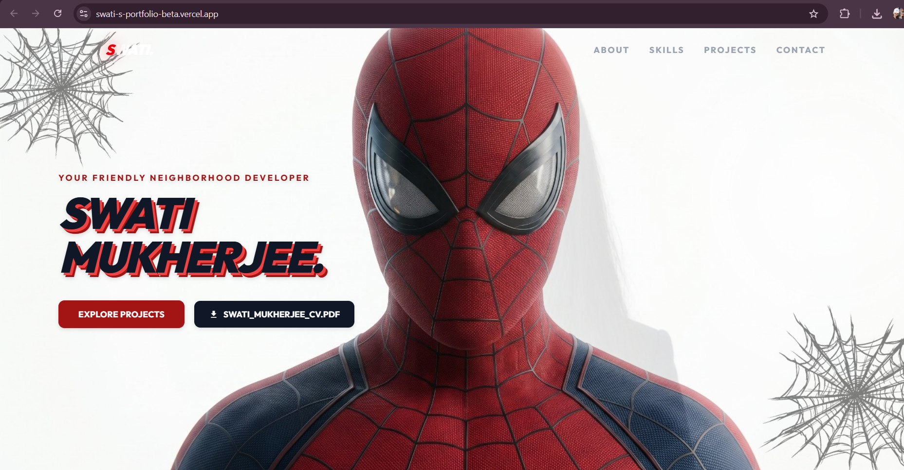
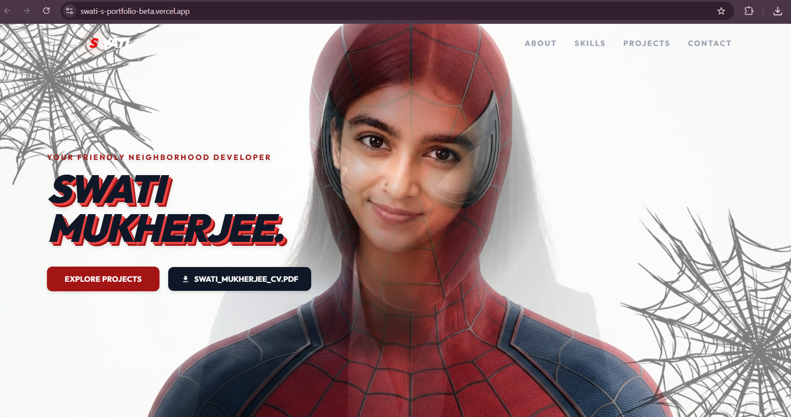

# Swati Mukherjee — Portfolio

A Spider-Man themed personal portfolio website built with Next.js, showcasing my projects, skills, and experience as a Full-Stack Developer.

🔗 **Live Site:** [swati-s-portfolio-beta.vercel.app](https://swati-s-portfolio-beta.vercel.app)
📄 **Resume:** [Swati_Mukherjee_FullStack.pdf](./Swati_Mukherjee_FullStack.pdf)

---

## 📸 Preview

The hero section features a mask-reveal effect — the Spider-Man mask morphs to reveal the developer underneath.




---

## ✨ Features

- 🕸️ Spider-Man inspired UI with animated web backgrounds and hanging character illustrations
- 🎭 Signature hero mask-reveal transition (mask morphs into a personalized illustration)
- 🎬 Smooth scroll-triggered animations powered by **GSAP**
- 📱 Fully responsive design across mobile, tablet, and desktop
- 📩 Working contact form (powered by **Web3Forms**, no backend required)
- ⚡ Built on **Next.js 16** with the App Router and Turbopack for fast builds

---

## 🛠️ Tech Stack

| Category | Technology |
|---|---|
| Framework | Next.js (App Router) |
| Language | TypeScript |
| Styling | Tailwind CSS |
| Animation | GSAP + ScrollTrigger |
| Forms | Web3Forms API |
| Deployment | Vercel |

---

## 🚀 Featured Projects

A few projects highlighted on this portfolio:

- **Bus Service Booking System** — A full-stack booking platform for managing bus routes, seats, and reservations.
- **ZapFlow** — A workflow automation tool for streamlining repetitive tasks.
- **AI Interviewer** — An AI-powered mock interview platform for practicing technical and behavioral interviews.

> 📌 *Update this section with links to each project's live demo/repo as they become available.*

---

## 📂 Project Structure

```
BrandNewDay/
├── public/
│   └── images/          # Site images (hero, spider illustrations, etc.)
├── src/
│   ├── app/              # Next.js app router pages
│   └── components/       # React components (sections, UI)
├── scripts/               # Utility scripts
├── docs/                   # Project documentation/research
└── package.json
```

---

## 🚀 Getting Started

### Prerequisites
- Node.js 18+ installed
- npm

### Installation

```bash
# Clone the repository
git clone https://github.com/Miliritgithub/Swati-s-portfolio.git
cd Swati-s-portfolio/BrandNewDay

# Install dependencies
npm install
```

### Environment Variables

Create a `.env` file in the root of the project:

```env
NEXT_PUBLIC_WEB3FORMS_ACCESS_KEY=your_web3forms_access_key_here
```

> Get a free access key at [web3forms.com](https://web3forms.com)

### Run the development server

```bash
npm run dev
```

Open [http://localhost:3000](http://localhost:3000) in your browser to view the site.

### Build for production

```bash
npm run build
npm start
```

---

## 📦 Deployment

This project is deployed on **Vercel**. Any push to the `main` branch automatically triggers a new production deployment.

> ⚠️ Note: Environment variables must be added separately in the **Vercel Dashboard → Settings → Environment Variables**, since `.env` files are git-ignored and not pushed to GitHub.

---

## 👩‍💻 About Me

**Swati Mukherjee**
Full-Stack Developer | B.Tech in Information Technology

Skilled in React.js, Next.js, TypeScript, Node.js, PostgreSQL, MongoDB, and building full-stack, AI-powered applications.

📄 [View My Resume](./Swati_Mukherjee_FullStack.pdf)

---

## 📄 License

This project is for personal portfolio use. Feel free to explore the code for learning purposes.
